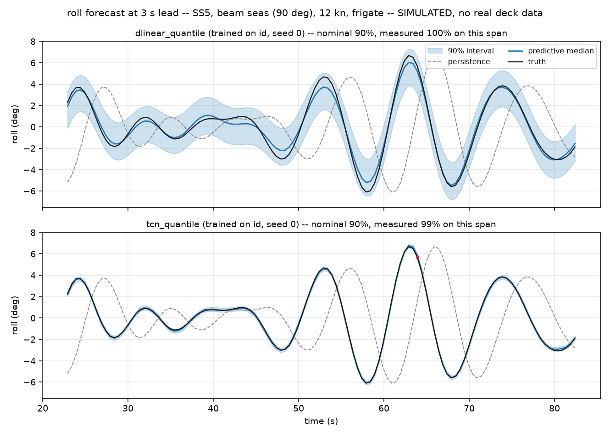
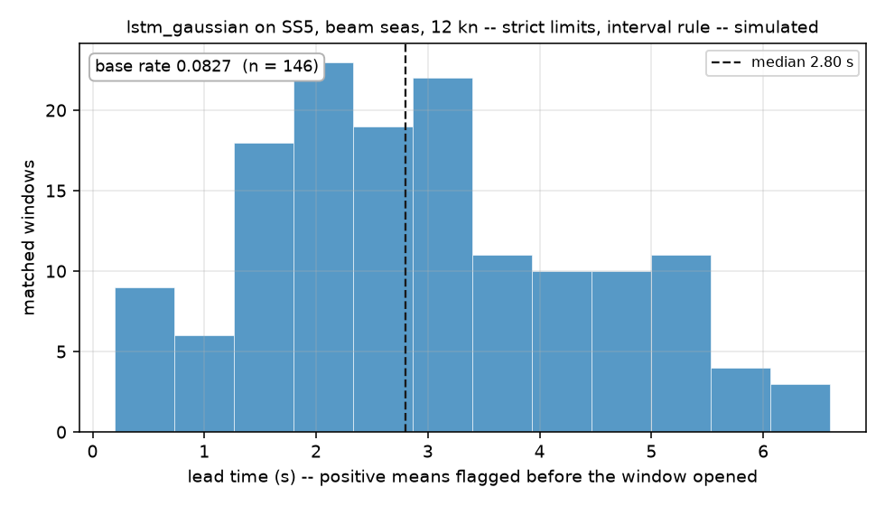

# deck-motion-forecast

Short-horizon (1–15 s) forecasting of 6-DOF ship deck motion — roll, pitch, heave and their
rates — for deciding when to commit a rotorcraft to a touchdown on a heaving deck, evaluated on
prediction intervals — split-conformal calibrated, and characterised where that calibration
stops working — and on operational quiescent-window detection rather than on RMSE alone. **Every result in this repository comes
from simulated vessel motion: a JONSWAP-driven linear seakeeping model. No real deck data is used
anywhere in this project, and no sim-to-real claim is made.**

The decision the forecast serves is a *quiescent window*: an interval in which all six channels
stay inside landing limits long enough to get the aircraft down. That, rather than raw RMSE, is
the metric this project is built around — and it behaves very differently from RMSE, which is
[the sharpest finding here](#the-decision-quiescent-window-detection).

**Status: Phases 1–10 complete.** Gates 1, 2, 4, 6, 7, 8 and 10 pass as written. Gate 3 **failed**
as written and was restated at the same threshold. Gate 5 passes at its pre-registered cell and
does **not** pass across the surrounding table. The full phase-by-phase record, including every claim
this project withdrew, is in [`docs/findings.md`](docs/findings.md).

---

## The forecast, with intervals



Roll at 3 s lead, SS5, beam seas, 12 kn, in distribution. Both panels are the same 60 s of the
same realization. Three things are worth reading off it:

- **Persistence (grey, dashed) is a full quarter-period out of phase.** At a 3 s lead on a ~9 s
  roll period, repeating the last sample is not a weak baseline, it is an inverted one. Persistence
  is nonetheless the denominator of every skill score in this project, which is why skill scores
  here are flattering and why `nrmse` is printed beside every one of them.
- **Both heads track the truth closely, and `tcn_quantile` is an order of magnitude sharper** —
  mean 90 % interval width 0.294° against `dlinear_quantile`'s 3.42° at this channel and lead
  (`mean_interval_width_mean` in `results/e03/probabilistic.csv`).
- **Both over-cover.** The bands are labelled 90 % and measure 100 % and 99 % on this span; over
  the `id` test partition at this same channel and lead they are 0.961 and 0.984 against a 0.90
  nominal. That is the calibration
  failure described in [Limitations](#limitations): the heads are calibrated at 10–15 s and
  systematically too wide across the 1–5 s band the landing decision is actually taken in.

The figure is regenerated by `make figures` from a 12 kB committed trace, with no corpus, no
checkpoints and no GPU.

## Accuracy: skill against persistence, across four regimes

Four evaluation regimes, **split by simulation seed, never by time window**. `id` holds out seeds
within every grid cell; the other three hold out a condition entirely: SS6, 90° beam seas, and the
S175 hull, which is never trained on in any regime.

Skill vs persistence at **pitch, 10 s** — the cell Gates 3, 4 and 5 are all read at — with the
parameter count and `nrmse` in distribution beside it. Closed-form models are deterministic and
carry one seed; SGD models are mean ± std over three. The parameter column spans 45x between models
compared head to head, which is context for every comparison below:

| model | params | `id` | `unseen_seastate` | `unseen_heading` | `unseen_vessel` | `nrmse` (`id`) |
|---|---:|---:|---:|---:|---:|---:|
| `persistence` | 0 | 0.0000 | 0.0000 | 0.0000 | 0.0000 | 1.256 |
| `window_mean` | 0 | 0.3656 | 0.3082 | 0.2246 | 0.1724 | 1.001 |
| `damped_persistence` | 6 | 0.3657 | 0.3082 | 0.2247 | 0.1724 | 1.000 |
| `ar10` | 54 900 | 0.5348 | 0.1384 | **−50.11** | 0.4644 | 0.857 |
| `ar20` | 108 900 | 0.5446 | 0.1584 | **−49.43** | 0.4786 | 0.848 |
| `ar40` | 216 900 | 0.5765 | 0.0856 | **−44.94** | 0.5263 | 0.817 |
| `ar_attitude_only` | 108 900 | 0.5419 | 0.2112 | **−18.27** | 0.4778 | 0.850 |
| `dlinear` | 60 300 | 0.5147 ± 0.0001 | **0.4775** ± 0.0003 | 0.5191 ± 0.0013 | 0.5019 ± 0.0009 | 0.875 |
| `dlinear_ols` | 60 300 | 0.5683 | 0.4499 | **0.5775** | 0.5344 | 0.825 |
| `tcn` | 196 804 | 0.8346 ± 0.0006 | 0.2772 ± 0.0322 | −81.09 ± 6.65 | **0.8298** ± 0.0034 | 0.511 |
| `transformer` | 2 712 708 | 0.8080 ± 0.0032 | 0.1953 ± 0.0270 | −79.22 ± 25.17 | 0.7250 ± 0.0141 | 0.550 |
| `lstm` | 317 828 | **0.8680** ± 0.0016 | 0.3437 ± 0.0241 | **−279.44** ± 59.98 | 0.8007 ± 0.0044 | 0.456 |

And at **heave, 3 s** — the channel and the lead time the landing decision actually uses. Every
model is listed, including the ones that lose:

| model | params | `id` | `unseen_seastate` | `unseen_heading` | `unseen_vessel` | `nrmse` (`id`) |
|---|---:|---:|---:|---:|---:|---:|
| `persistence` | 0 | 0.0000 | 0.0000 | 0.0000 | 0.0000 | 1.516 |
| `window_mean` | 0 | 0.4746 | 0.4298 | 0.4512 | 0.4339 | 1.099 |
| `damped_persistence` | 6 | 0.4663 | 0.4311 | 0.4477 | 0.4333 | 1.108 |
| `ar10` | 54 900 | 0.9956 | 0.9937 | 0.9892 | 0.9967 | 0.100 |
| `ar20` | 108 900 | 0.9974 | 0.9960 | 0.9929 | 0.9979 | 0.077 |
| `ar40` | 216 900 | 0.9985 | 0.9978 | **0.9962** | **0.9988** | 0.058 |
| `ar_attitude_only` | 108 900 | 0.9947 | 0.9926 | 0.9877 | 0.9944 | 0.111 |
| `dlinear` | 60 300 | 0.9502 ± 0.0001 | **0.7743** ± 0.0006 | 0.9701 ± 0.0002 | 0.9405 ± 0.0003 | 0.339 |
| `dlinear_ols` | 60 300 | 0.9823 | 0.9013 | 0.9895 | 0.9782 | 0.202 |
| `tcn` | 196 804 | **0.9987** ± 0.0001 | **0.9941** ± 0.0004 | 0.9252 ± 0.0113 | 0.9877 ± 0.0015 | 0.055 |
| `transformer` | 2 712 708 | 0.9972 ± 0.0005 | 0.9644 ± 0.0051 | 0.9571 ± 0.0049 | 0.9476 ± 0.0047 | 0.080 |
| `lstm` | 317 828 | **0.9987** ± 0.0001 | 0.9746 ± 0.0033 | **0.6760** ± 0.0476 | 0.9840 ± 0.0022 | 0.055 |

At 3 s on heave the whole field above `damped_persistence` sits between 0.94 and 0.999 and the
differences are not readable from this table. **They are readable from a paired test, and they go
the other way.** Paired bootstrap against `dlinear_ols`, counting cells whose 95 % interval excludes
zero, `unseen_heading` excluded (`results/e02/paired_contrasts.csv`):

| band | `tcn` | `transformer` | `lstm` |
|---|---|---|---|
| **1–5 s** — the operational band this project exists to serve | 34 – 34 | 19 – 47 | 23 – 42 |
| **10–15 s** — where Gate 4 is read | 26 – 8 | 25 – 8 | 26 – 7 |

**The deep models' advantage is concentrated at long lead times.** In the 1–5 s band `tcn` ties the
closed-form linear model and the other two lose to it roughly 2:1. Gate 4's 10 s cell was fixed in
advance of the sweep and on Gate-3-era reasoning, so this is not cell-picking — but the gate is read
where the deep models look best, and that belongs next to the word "passes".

**Read these numbers with four caveats, none of which is optional.**

1. **The task is easy by construction, and every absolute number here is flattered by it.** The
   generator has no process noise and the vessel RAO is a narrowband filter, so the deck record is
   a finite sum of sinusoids — which satisfies an *exact* linear recursion. Least-squares AR over
   200 lags is therefore **identifying** the system, not approximating it, which is why heave at
   3 s runs to 0.998. The shuffle control settles that this is not leakage: refitting **AR(20)** on
   time-shuffled targets leaves at most **0.0095 excess** against a 2 % tolerance over 144 rows.
   Two things travel with that. The control's subject is AR(20), not the best model — it certifies
   the pipeline the deep rows are built on, not the deep rows. And its residual-floor exemption
   (cells whose test signal sits on the P1-D2 floor are computed and reported, never asserted on)
   was introduced *after* the control failed at 5.52 % on one arm; raising the tolerance instead was
   considered and rejected. Read **relative** comparisons and **out-of-distribution degradation** as
   findings; do not read an absolute skill here as an achievable accuracy.
2. **Gate 3 failed as written, and was restated rather than relaxed.** The original criterion said
   AR(p) must *not* exceed 0.8 skill at 3 s on roll, or the task is too easy. It measured 0.9987.
   The failure is recorded as a failure; the gate was restated at the **same 0.8 threshold**, read
   at the decision horizon on the binding DOF, where AR(20) scores 0.545 and passes. Both readings
   are in [`docs/findings.md`](docs/findings.md#phase-3--baselines-and-the-gate-that-failed).
3. **`persistence` has `nrmse` above 1.0 in every column of the two tables above** — 1.26 at
   pitch/10 s and 1.52 at heave/3 s — meaning that at these cells the denominator of the skill
   score is itself worse than predicting the test partition's mean. Across all 144 cells it is
   above 1.0 in 111 and below in 33, best 0.459, so this is a statement about the long horizons
   and not about every cell. A zero-parameter `window_mean` beats it in 107 of 144
   cells. Skill against a bad reference is not evidence of a good forecast, which is why `nrmse` is
   printed beside it.
4. **`unseen_heading` is part corpus artifact and part real failure.** That regime's test set is
   entirely beam seas, where the pitch heading factor sits on a residual floor of 0.05, so a model
   fitted where pitch is a real signal imposes an amplitude on a channel that has almost none —
   hence −49 to −279. The two channel-independent DLinear rows structurally cannot import that
   amplitude and survive. But the floor does **not** explain the direction on roll and heave, where
   it does not apply and the deep models still lose. It is a real heading-generalisation failure
   with an artifact on top of it.

### Transfer to an independent hydrodynamic model

**The result that qualifies every row above.** The same `unseen_vessel` checkpoints and the same
hull, scored against the MSS toolbox's ShipX strip-theory RAOs. Pitch at 10 s. The corpus column
here is **not** the `unseen_vessel` column above: it is the corpus restricted to the cells MSS was
run on (SS5, headings 135° and 180°, three speeds), because that is the only comparison in which
the generator is the sole thing that changes. Full table and controls in
[`docs/mss_crossvalidation.md`](docs/mss_crossvalidation.md):

| model | corpus (matched cells) | MSS | change |
|---|---:|---:|---:|
| `dlinear` | 0.4144 ± 0.0015 | **0.3935** ± 0.0017 | −0.021 |
| `dlinear_ols` | 0.4904 | **0.3835** | −0.107 |
| `damped_persistence` | 0.0734 | −0.0585 | −0.132 |
| `window_mean` | 0.0733 | −0.0586 | −0.132 |
| `ar20` | 0.5258 | 0.1560 | −0.370 |
| `ar10` | 0.5195 | −0.0004 | −0.520 |
| `transformer` | 0.7654 ± 0.0323 | −0.1773 ± 0.0295 | −0.943 |
| `ar40` | 0.5412 | **−0.7243** | −1.266 |
| `tcn` | 0.8604 ± 0.0040 | **−0.9033** ± 0.1384 | −1.764 |
| `lstm` | 0.8032 ± 0.0169 | **−1.5564** ± 0.5995 | −2.360 |
| `persistence` | 0.0000 | 0.0000 | 0.000 |

Every model scored on both generators is listed. `ar_attitude_only` is the one corpus baseline
absent here: it was never run on the MSS records, so it has no transfer number rather than a
withheld one.

Only the DLinear family transfers with its skill largely intact, losing 0.02–0.11. **`ar20` is the
one other model that keeps positive skill** — 0.156, down 0.37 — and `ar10` lands exactly on
persistence at −0.0004. The four heaviest models fall *below* persistence, losing 0.94 to 2.36.
**The dividing line is not linear versus deep.** `ar40` is linear, per-channel, beats `dlinear_ols`
on the corpus, and transfers worse than `transformer`. What separates them is how completely a model
identifies *this* generator's dynamics — `ar40` loses 1.27 where `ar20` loses 0.37, on the same
model class at twice the order. **That ladder is not monotone at the short end**: `ar10` loses 0.52,
worse than `ar20`, so "less capacity transfers better" is the wrong summary and the AR family peaks
at order 20 rather than at its floor. Both sides are simulations; this bounds generator-specific
overfitting and says nothing about fidelity to a real ship.

## The decision: quiescent-window detection

The operational metric, and the reason this project does not report RMSE alone. A quiescent
window is an interval in which roll, pitch and heave rate all stay inside landing limits long
enough to get an aircraft down. Two threshold sets, and two decision rules: the **point** rule
flags a window when the point forecast is inside limits, the **interval** rule flags it when the
whole 90 % predictive interval is.

Mean F1 over the scorable cells of each regime, ± the spread across the three training seeds
(closed-form models are deterministic and marked `det.`). **The base rate is printed beside every
F1**,
because an F1 without it is uninterpretable — the strict base rate on `unseen_seastate` is 0.0245,
and almost any number looks impressive against that. `always_quiescent` and `rate_matched`
(chance timing at the true onset rate) are forecast-free nulls and apply to either rule:

| regime | thresholds | base rate | best **interval** | best **point** | `always_quiescent` | `rate_matched` |
|---|---:|---:|---|---|---:|---:|
| `id` | permissive | 0.5655 | `dlinear_gaussian` **0.4405** ± 0.0012 | `lstm_quantile` 0.2724 ± 0.0230 | 0.0406 | 0.0463 |
| `id` | strict | 0.3494 | `lstm_gaussian` **0.4211** ± 0.0061 | `lstm_quantile` 0.1939 ± 0.0255 | 0.0143 | 0.0144 |
| `unseen_seastate` | permissive | 0.2068 | `tcn_gaussian` **0.3749** ± 0.0106 | `lstm_gaussian` 0.1666 ± 0.0037 | 0.0352 | 0.0419 |
| `unseen_seastate` | strict | 0.0245 | `lstm_gaussian` **0.3863** ± 0.0107 | `lstm_gaussian` 0.1443 ± 0.0040 | 0.0042 | 0.0054 |
| `unseen_heading` | permissive | 0.5227 | `dlinear_gaussian` **0.4292** ± 0.0010 | `damped_persistence` 0.1998 (det.) | 0.0382 | 0.0455 |
| `unseen_heading` | strict | 0.3511 | `tcn_gaussian` **0.2031** ± 0.0238 | `dlinear_ols` 0.0798 (det.) | 0.0132 | 0.0136 |
| `unseen_vessel` | permissive | 0.6686 | `dlinear_gaussian` **0.4149** ± 0.0038 | `damped_persistence` 0.2119 (det.) | 0.0404 | 0.0478 |
| `unseen_vessel` | strict | 0.4296 | `tcn_gaussian` **0.2748** ± 0.0027 | `tcn_quantile` 0.0980 ± 0.0008 | 0.0167 | 0.0224 |

Four readings, three of them unflattering:

1. **The interval rule roughly doubles the point rule in every regime.** Requiring the whole band
   to clear the limit is a materially better detector than requiring the median to. That is the
   clearest operational argument in this project for carrying a predictive distribution at all.
2. **`persistence` and `window_mean` score F1 = 0.0000 in every cell.** They never fire. The
   skill-score denominator of the entire project is useless at the task the project exists for.
3. **The best F1 anywhere is 0.44**, and 0.20 on `unseen_heading` under strict limits. The
   detectors beat the nulls by a wide margin and are doing real work, but this is not a solved
   problem.
4. **The false-alarm rate is what the F1 hides.** For the best-F1 model in each row above it runs
   **2.6–41.7 per minute on the point rule** and **0.3–5.6 on the interval rule**. Across all
   models and all scorable cells the medians are 16.7 and 2.8 per minute, with maxima of 117.0 and
   60.0. A detector firing 40 times a minute cannot be acted on, and the point rule exceeds 20 per
   minute in four of the eight rows.

**Scorability is a property of the cell, not of the sea state.** On `id` at permissive thresholds,
54 of 288 cell-rows have nothing to detect — the deck never leaves limits, base rate 1.0, zero
onsets. All 54 are SS3. Those render `not scorable`, never F1 = 0 (which reads as model failure)
and never F1 = 1 (which reads as a perfect detector). An earlier version of this analysis pooled
them into a sea-state roll-up and was retracted whole; F1 is never pooled across sea states
anywhere in this project.



Lead time — how far ahead of a true onset the model flagged it — is what decides whether a
detection is actionable at all: a correct call issued 0.2 s before touchdown gives the controller
nothing to work with. For the best-F1 model in each row above, the per-cell median lead averaged
over that row's scorable cells runs **0.49–3.02 s on the interval rule** and **0.53–7.70 s on the
point rule** (these are means of per-cell medians, not medians of the pooled distribution) — the point rule buys its longer leads
with the precision and false-alarm rates above, which is not a trade a landing decision can make.

**And the metric could not be compared across generators at all.** Quiescence thresholds are
absolute (3.0° / 2.0° / 0.8 m/s), and our generator runs **1.0–2.3x hot depending on channel and
heading** — 1.01x, 1.28x and 1.32x at bow-quartering against 2.27x and 2.34x in head seas, with the
per-speed spread inside the bow-quartering roll row alone running 0.61x to 1.54x — so the same
limits classify far more of the MSS record as landable — in head seas the MSS deck *never leaves limits*, base rate
1.0000, nothing to detect, against a corpus base rate of 0.655 in the same cell. Skill is a ratio
and was untouched by the amplitude gap; the operational metric was dominated by it to the point of
becoming undefined. That is the sharpest result in Phase 8 and it is a methodological one.

## Prediction intervals: the trivial baseline wins in distribution

Six learned interval heads — quantile (nine levels, pinball loss, post-hoc sorting) and Gaussian
(mean and log-variance, NLL) — on three backbones. **Gate 5 passes at its pre-registered cell**
(PICP@90 within [0.85, 0.95] at pitch / 10 s on `id`, 6 of 6) and **does not pass across the
surrounding table** (102 of 216). Both readings are reported; the second is not a footnote.

The comparison that matters is against a floor. `residual_interval` is an empirical-residual band
fitted on the validation split around a closed-form point forecast — no learned width, nearly
free. Cells inside the Gate 5 band:

| regime | `residual_interval` floor | best learned head | all six heads |
|---|---:|---:|---:|
| `id` | **36 of 36** | `dlinear_quantile` 21 of 36 | 102 of 216 |
| `unseen_vessel` | **26 of 36** | `dlinear_quantile` 19 of 36 | 41 of 216 |
| `unseen_heading` | 12 of 36 | `dlinear_quantile` 19 of 36 | 37 of 216 |
| `unseen_seastate` | **0 of 36** | — | 5 of 216 |

**In distribution the trivial baseline is perfectly calibrated and every learned head is not** —
36 of 36 against a best of 21. **And the proper score disagrees, decisively.** Median Winkler on
`id`, which scores location and sharpness jointly (lower is better): floor 1.5897, `lstm_gaussian`
**0.1714**, `tcn_quantile` 0.2848 — the deep heads beat the floor by roughly 9x — while
`dlinear_gaussian` 2.1353 and `dlinear_quantile` 2.0937 *lose* to it. The floor buys its coverage
with width. Reporting either column alone would support a confident and opposite conclusion, so
both are printed.

**Coverage collapses under sea-state shift, and the floor collapses with it.** Only the TCN family
scores any cell in band there — 5 of 72, `tcn_quantile` 3 and `tcn_gaussian` 2 — while DLinear and
LSTM score zero of 72, and so does the residual-interval floor, down to PICP 0.2202 on heave at
5 s. A band fitted on SS3–SS5 residuals is the wrong width for SS6 however it
was obtained. This is reported, not fixed.

## Calibration: split conformal is exact in distribution and harmful under shift

Phase 10 calibrates the six heads with split conformal (CQR), fitting one scale factor per
(horizon, channel) on each regime's **validation** split and re-scoring on test. Nothing is
retrained. The uncalibrated rows above are untouched — this arm is additive, because Gate 5
requires the out-of-distribution degradation to be *reported, not fixed*.

In-band means PICP@90 inside Gate 5's `[0.85, 0.95]`, out of 216 cells per regime:

| regime | in-band | median PICP | cells that got **worse** | mean width | median Winkler |
|---|---:|---:|---:|---:|---:|
| `id` | 102 → **216**/216 | 0.9451 → **0.9001** | 1.9% | −17.5% | **−3.5%** |
| `unseen_seastate` | 5 → **0**/216 | 0.6099 → 0.5118 | 87.0% | −18.5% | +11.1% |
| `unseen_heading` | 37 → **27**/216 | 0.4940 → 0.4613 | 77.8% | −17.6% | +5.2% |
| `unseen_vessel` | 41 → **59**/216 | 0.6910 → 0.6308 | 78.2% | −16.9% | +4.1% |

**In distribution it works exactly, and for free.** All 216 cells land in band; at the gate cell
the six heads sit between 0.8989 and 0.9025. And the intervals get **17.5% sharper** — the
uncalibrated heads were over-covering (median 0.945 against a nominal 0.90) and paying for it in
width, so calibration recovered width rather than costing it.

**Out of distribution it is worse than doing nothing.** Coverage moves *further* from nominal in
78–87% of cells in all three shifted regimes, the Winkler score worsens in all three, and on
`unseen_seastate` the in-band count goes to **zero**.

**The mechanism is one column wide.** The width change is nearly identical everywhere: −16.9% to
−18.5%. The scale factor is always fitted on that regime's validation split, which is always
in-distribution — validation is carved from the *complement* of the held-out condition — so
calibration applies the same correction in every regime and only the test set differs.
Validation says the intervals are too wide, because in-distribution they are. The shifted test
set needs them wider. Split conformal narrows confidently in the wrong direction, and nothing
inside the procedure can detect it.

**Read `unseen_vessel` carefully**: its in-band *count* rises (41 → 59) while its median coverage
*falls* and 78% of its cells get worse. The count and the distribution move in opposite
directions there, which is why this table has four columns.

Two things these rows do **not** say. Their `crossing_rate` is 0.000 by construction — the
wrapper sorts the base fan before scaling, so the measurement is removed, not the crossing; the
uncalibrated rows keep the real number. And the finite-sample term is nominal: 25 000 windows at
0.5 s spacing on a ~12 s roll period are far fewer than 25 000 independent samples, so the
binding uncertainty is the realization bootstrap interval, not `1/(n+1)`.

Full tables: [`results/e05/`](results/e05/). Pre-registration and the scored predictions —
**two of four were falsified** — are P10-D1 and P10-D2 in [`docs/protocol.md`](docs/protocol.md).
Gate 10 passes 7/7, including a digest check that the uncalibrated tables were never rewritten.

## Inference latency -- ONNX export and the CPU-versus-GPU question

Four trained graphs (`tcn`, `lstm`, and their nine-quantile twins; regime `id`, seed 0) exported to
ONNX at opset 18, dynamic batch axis only, then benchmarked across five backends at batch 1 and
batch 32. Full tables, provenance markers and the environment stamp: **`results/latency.md`**,
`results/latency.csv`, `results/latency.json`, `results/parity.csv`,
`results/latency_stability.csv`, `results/latency_threads.csv`, `results/latency_pareto.png`.

**Methodology**, because latency numbers without it are decoration: 200 warmup then 2000 timed
iterations per configuration; each configuration in its own subprocess; `torch.cuda.synchronize()`
around every timed GPU region, and the harness *refuses* to time a CUDA run without it; one
iteration measured host to host (NumPy window in, NumPy forecast out, device transfers included) so
every backend is the same quantity; CPU threads pinned to 1 and recorded on every row; p50, p90,
p99, mean, std, throughput and peak memory reported, because a mean without a tail hides the
iteration that misses the deadline. Parity is checked **before** any timing: 1000 random windows per
draw, five draws, `max_abs_err < 1e-4 * max(1, |y|max)` -- a scale-relative criterion adopted
deliberately and recorded as a threshold change in `docs/protocol.md` P7-D3, with the plan's
original unscaled 1e-4 still reported per model in `parity.csv`.

Parity is checked **on every execution provider that gets benchmarked**, not on the CPU one alone,
and TF32 is disabled throughout. Both of those are late corrections rather than original design.
With TF32 at its Ampere default all three GPU providers fail the parity bar that the CPU provider
passes -- by five to fifty times -- so every GPU row in the first version of this study was timing a
reduced-precision computation while the CPU rows ran full FP32, and nothing raised
(`docs/protocol.md` P7-D9). 15 of the 16 (model, provider) pairs pass; the sixteenth,
`lstm_quantile` on PyTorch-CUDA, is refused and therefore never timed.

**The scale-relative criterion decides four of those sixteen rows, across two models** -- all three
`lstm_quantile` ORT providers plus `lstm` on PyTorch-CUDA -- each of which passes the scaled test
and fails the plan's unscaled 1e-4. That is not a bookkeeping detail: `lstm/torch:cuda` holds the
best batch-1 median for its model and a seat on the Pareto frontier, so under the original criterion
it would have been refused and the frontier would have a different member. PyTorch's own FP32 output
also misses the unscaled bar against the same model in FP64, which is what rules out an export
defect and is why the criterion is scale-relative at all.

### What was measured, at batch 1 -- the operational case

**The expected result -- "a model this small should run faster on the CPU" -- holds for the
recurrent models and does not hold for the convolutional ones.** Reporting only the half that
matched the expectation would have been the easy version of this section.

| model, batch 1 | ORT CPU | ORT CUDA | TensorRT | torch eager CUDA | best p50 |
|---|---|---|---|---|---|
| `tcn` | 0.689 / 0.900 | 0.739 / 1.766 | **0.445** / 0.876 | 2.963 / 3.872 | TensorRT |
| `tcn_quantile` | 0.904 / 1.101 | 0.797 / 1.740 | **0.443 / 0.766** | 2.909 / 3.462 | TensorRT |
| `lstm` | 1.625 / **1.962** | 8.152 / 13.122 | 4.293 / 9.118 | **1.300** / 1.962 | PyTorch CUDA |
| `lstm_quantile` | **2.008 / 2.408** | 7.969 / 13.012 | 4.241 / 9.979 | *refused* | ORT CPU |

p50 / p99 in ms, one intra-op thread, run 1 of 2. `torch-compile` on CUDA is omitted for width and
is close to eager on every row; the full five backends are in `results/latency.csv`.
**`lstm_quantile` on PyTorch-CUDA is not slow, it is absent** -- it fails the parity check and was
refused rather than timed (point 4 below), so its column has no number rather than a large one.

1. **On the recurrent models the ORT CPU provider wins by a wide margin** -- 5.0x over ORT CUDA on
   `lstm`, 4.0x on `lstm_quantile`, and 2.6x over TensorRT. A 200-step recurrence is a chain of
   small dependent kernels, so the GPU never gets a batch large enough to amortise a launch.
   **But it does not beat every GPU path**: eager PyTorch on CUDA runs `lstm` at 1.300 ms against
   ORT CPU's 1.625, 1.2x faster, and it passes parity. On `lstm`'s *tail* the two are 1.962 against
   1.962 -- a 0.04 percent margin that reverses in the second run, so it is a tie, not a win.
2. **On the convolutional models TensorRT wins the median** -- 1.6x over ORT CPU on `tcn`, 2.0x on
   `tcn_quantile` -- and a dilated convolution stack is exactly the shape a GPU can feed. Against
   ORT's *CUDA* provider the CPU still wins `tcn` (1.1x) but loses `tcn_quantile` (0.9x).
3. **The tail is where the CPU recovers, and thread count decides it.** At one thread the `tcn`
   p99 comparison flips between repeats (ORT CPU 0.900 then 0.853 ms; TensorRT 0.876 then 0.919) --
   a tie, not a win. Give the CPU a modest budget and it stops being one: at 8 threads `tcn` on ORT
   CPU reaches 0.465 ms p50 / 0.573 ms p99, matching TensorRT's median and beating its tail. The
   recurrent models move the other way, degrading monotonically from 1.604 ms at one thread to
   2.144 ms at eighteen, because a recurrence does not parallelise.
4. **One configuration was refused rather than timed.** `lstm_quantile` on PyTorch-CUDA fails the
   parity check, because cuDNN's fused LSTM -- the very thing that makes PyTorch fast on the
   recurrent models -- accumulates a 200-step recurrence differently enough to miss the tolerance.
   It is not TF32 and not the hardware: with cuDNN disabled the CUDA result matches the CPU's
   accuracy exactly and runs more than an order of magnitude slower than ORT CPU
   (`docs/protocol.md` P7-D10). An earlier draft of this section reported the fast number as a
   genuine exception to the CPU case; per-provider parity withdrew it.

**At batch 32 the GPU wins overwhelmingly** -- TensorRT reaches 44 123 windows/s on `tcn` against
ORT CPU's 1 367. It does not change the conclusion and it is not buried: a landing aircraft
forecasts one deck, so batch 1 is the mission and batch 32 is a throughput datapoint.

**Run-to-run stability is a partial failure of the plan's own checkbox.** 9 of 52 configurations
drift more than 10 percent between the two sweeps on p50 or p99, listed in
`results/latency_stability.csv` and `docs/protocol.md` P7-D13. They fall as four
`torch.compile`, three `torch-eager` and two TensorRT engine-build; `tcn_quantile` on TensorRT at batch 1 is
among them (13.5 percent on p99), which is one of the rows carrying claim 2, so that claim is read
on the median -- stable in both runs -- rather than on the tail.

### What it implies, and what it does not

Every configuration measured clears a 10 Hz control cycle by more than an order of magnitude: the
slowest batch-1 median in the sweep is 8.152 ms against a 100 ms budget. **So the deployment
question is not whether the CPU is fast enough -- it is, on every model, at one thread -- but what
the GPU would buy.** On the convolutional models it buys roughly a factor of two on the median. On
the recurrent ones it buys nothing through ONNX Runtime, and about 1.2x through PyTorch's own cuDNN
path on `lstm` -- with no tail improvement, and unavailable on `lstm_quantile`, where that path
fails parity. All of it is paid for by contending with the perception stack for the device, on a
budget already exceeded a hundredfold.

That is the honest case for putting a deck-motion forecaster on the flight controller's CPU, and it
is weaker than "the CPU is faster" -- which is what the first version of this section said, before
TF32 was disabled and the sweep re-run. It rests on sufficiency and on not competing for a
contended resource, not on winning a race.

**The RTX A4000 here is a workstation GPU standing in for an embedded target, and the CPU is an
18-core / 36-thread i9-10980XE. Absolute numbers do not transfer to a flight controller.** No number
in this section comes from anywhere but this machine; no speedup multiple is quoted that is not a
ratio of two rows in `results/latency.csv`, and `make gate7` checks that mechanically. All results
are from **simulated** vessel motion.

## Reproducing this

```bash
python3 -m venv .venv && . .venv/bin/activate
pip install -e ".[dev]"
make lint && make test        # ruff + mypy, then the test suite -- minutes
make all                      # the whole project from nothing -- about 7 days
```

`make all` is the full sequence: generate the corpus, run every training sweep, re-score the
matched-origin arms, assemble and render `results/results.md`, read Gates 4–7, run the Phase 8
cross-validation, and regenerate the figures. It totals **about 163 hours on one RTX A4000** —
call it a week. This is not an afternoon:

| stage | target | wall clock | source |
|---|---|---|---|
| corpus generation (2304 realizations, 1.1 GB) | `make data` | ~15 min at 24 workers | `docs/corpus_card.md` |
| baselines, `ideal` + `imu` | `make sweeps` | **7.15 h** | logged |
| deep models (e02) | `make sweeps` | ~31 h | protocol prose |
| probabilistic heads (e03) | `make sweeps` | ~66 h | protocol prose; 60.65 h traceable as summed fit time |
| ablations, deep arms (e04) | `make sweeps` | **48.29 h** | logged |
| ablations, cheap arms + re-score + residual floor | `make sweeps` | **1.20 h** | logged |
| evaluation and render, end to end | `make gate6-full` | **8.76 h** | logged |
| ONNX export, parity, two latency sweeps | `make bench` | ≥ 32 min of timed iterations | derived from `results/latency.csv` |
| MSS cross-validation | `make mss` | not recorded | — |

**Only the four bold rows are traceable from a clone.** They come from
[`results/runtime_stages.csv`](results/runtime_stages.csv), which `scripts/collect_runtimes.py`
derives from the stage logs; those logs live under `artifacts/`, which is gitignored, so the CSV is
the committed record. The e02 and e03 sweeps predate that convention and their figures come from
`docs/protocol.md` prose — and e03's wall clock is not traceable even there, because its sweep log
was captured empty, leaving only the 60.65 h that `fit_time_s` sums to. The `make bench` figure is
the part that can be reconstructed from a committed table (52 configurations x 2200 iterations at
their measured mean, twice) and excludes export, parity checking, TensorRT engine builds and the
thread sweep, so the real number is larger. `make mss` was never timed. Rather than quote figures
nothing supports, this table says which rows are measured and which are not.

Most individual pieces are far cheaper than the whole. Useful partial targets:

| command | what it does | needs |
|---|---|---|
| `make test` / `make lint` | test suite; ruff + mypy | nothing |
| `make figures` | re-render both figures from the committed trace and CSVs | nothing |
| `make report` | re-render `results/latency.md` and the Pareto figure from the CSVs | nothing |
| `make eval` | re-score from committed checkpoints and rebuild `results/results.md` | corpus + checkpoints |
| `make gate4`, `make gate5`, `make gate7` | re-read each gate from its committed artifacts | nothing |
| `make gate6-full` | re-score, re-render `results.md`, then read Gate 6 | corpus + checkpoints |

`make figures`, `make report` and gates 4, 5 and 7 read committed artifacts only — no corpus, no
checkpoints, no GPU. **`make gate6` is the exception and is not in that list**: predicate 1 has no
artifact to read without an `eval` exit status, so run alone it reports 6 of 7 and overwrites the
committed `results/gate6.csv` with that weaker verdict. Use `make gate6-full`, which runs `eval`
first. That is deliberate: it makes "is this document a function of the committed
tables?" a question anyone can answer in a second, and `make gate6` verifies that re-rendering
`results/results.md` from the CSVs reproduces it byte for byte.

**What is and is not in the repository.** `results/` is committed in full, including every figure
and the 6 MB `results.md`. `artifacts/` — the 1.1 GB corpus, 335 MB of checkpoints, the ONNX
graphs and the run logs — is gitignored and regenerated by `make data` and `make sweeps`. Seeds
are fixed and recorded; the corpus is reproducible from `configs/sim/corpus.yaml` plus the seeding
rule in [`docs/corpus_card.md`](docs/corpus_card.md).

## Limitations

Read these before reading any number above.

**The simulation itself**

- **Linear seakeeping throughout.** A linear RAO applied to a finite sum of sinusoids. No
  nonlinear roll damping, no green water, no parametric resonance, no slamming.
- **Unidirectional seas.** A single JONSWAP spectrum from one direction, with no directional
  spreading and no swell / wind-sea bimodality. Real short-crested seas are not this.
- **Fixed heading and speed within a realization.** No manoeuvring, no course or speed change, no
  response to the sea state.
- **No process noise anywhere in the generator.** This is the most consequential one. A finite sum
  of sinusoids satisfies an exact linear recursion, so the Bayes-optimal forecaster for this corpus
  **is linear, by construction**. "A closed-form linear model is competitive with three deep
  architectures" is therefore a far weaker statement here than it would be on a stochastic process,
  and says nothing about how these architectures would rank on real deck motion.
- **A known, unfixed defect in the cross-DOF structure.** `src/dmf/sim/response.py` applies a
  **real** wave-slope excitation, so roll and pitch come out in phase with heave where strip theory
  puts them in quadrature — measured 0.1° against 87.8°. Per-DOF marginals are unaffected and every
  Gate 1 invariant still holds, because a common phase rotation within one channel does not change
  its spectrum. It is **not fixed**: fixing it invalidates the corpus and every result in Phases 2
  through 7. The models have therefore been trained to exploit a roll/pitch/heave phase
  relationship strip theory says is wrong by 90°, and that is carried openly rather than buried.
- **Residual heading floors are an engineering stand-in, not a derived quantity.** The roll and
  pitch heading factors carry a floor of 0.05, which puts an off-axis DOF about 26 dB down instead
  of identically zero. It stands in for hull asymmetry and short-crested residual excitation. It
  contaminates more downstream results than anything else in the project — most visibly the
  `unseen_heading` regime, whose entire test set is beam seas.

**The evaluation**

- **Simulation only; no real-deck validation.** The Phase 8 cross-check is against *another
  simulator*. It bounds generator-specific overfitting. It is not evidence about a real ship.
- **The sea state is assumed known in the conditioning ablation.** That arm consumes privileged
  information — at deployment the sea state is estimated online from the same motion record the
  forecaster reads — so no row of it is a deployable result. It is also **not** an upper bound: it
  costs mean skill on `unseen_seastate` — −0.0191 pooled over the arm, −0.0445 on `tcn` alone —
  and a bound below the unconditioned baseline on the regime that matters bounds nothing.
- **Calibration is only meaningful in distribution.** Split conformal is run (Phase 10) and is
  exact on `id`, but the calibration split is drawn from the complement of each regime's
  held-out condition, so under shift it applies an in-distribution correction to an
  out-of-distribution test set and makes coverage **worse** in 78–87% of cells. The deliverable
  "calibrated prediction intervals" is met in distribution and **not** met under shift, and no
  procedure here can tell the two apart from the calibration data alone.
- **One integrity control is vacuous on one regime.** The interval shuffle control asserts on
  222 of 432 rows; on `unseen_seastate` it asserts on **zero**. "Passed" there means nothing was
  judged. Its tolerance was also changed after seeing the data (0.02 → 0.10) and is labelled as
  such. Separately, the untrained-model control fails its literal criterion in 76 of 144 rows on the
  reference arm — and in 23 to 107 rows on each of the other seven arms, worst on the
  probabilistic one. It is **reported rather than enforced**, because the criterion is wrong for a
  task where a zero-parameter window mean already beats persistence.
- **Latency tails are not reproducible to the plan's own standard.** p50 is stable across two
  independent sweeps in 52 of 52 configurations; **p99 drifts more than 10 % in 9 of 52**, worst
  case 43.6 %. Claims in this README that depend on a tail are read as ties.
- **Cell counts are a description of one table, not a hypothesis test.** Where this README counts
  "wins in N of 144 cells", those cells are not independent and no multiplicity control is applied.
- **Absolute latency does not transfer.** The GPU is a workstation RTX A4000 standing in for an
  embedded target and the CPU is an 18-core i9-10980XE. Ratios between rows measured on the same
  machine are the claim; the milliseconds are not.

## Documentation

| | |
|---|---|
| [`docs/findings.md`](docs/findings.md) | The phase-by-phase record, with every withdrawn claim beside the one that replaced it. Start here. |
| [`docs/protocol.md`](docs/protocol.md) | The complete decision log, ~5200 lines. Every gate, every threshold change, every retraction, with what was measured. |
| [`results/e05/`](results/e05/) | Phase 10: the calibrated tables, the fitted scale factors with their provenance, the coverage degradation, and the Gate 10 read-out. |
| [`docs/audit_report.md`](docs/audit_report.md) | The pre-release audit: three blocking findings, ten should-fix items, the §5 validation protocol checkbox by checkbox, and the re-verification that follows it. Two of the audit's own numbers did not reproduce and were not adopted. |
| [`docs/corpus_card.md`](docs/corpus_card.md) | What the corpus contains, how it is generated, and how to reproduce it. |
| [`docs/mss_crossvalidation.md`](docs/mss_crossvalidation.md) | Phase 8 in full: the Octave parity check, the two-generator comparison, and what the transfer failure does and does not show. |
| [`docs/IMPLEMENTATION_PLAN.md`](docs/IMPLEMENTATION_PLAN.md) | The original plan. Where it and the protocol disagree, the protocol is what happened. |
| [`results/results.md`](results/results.md) | The machine-generated evaluation report — 20 tables, each naming its source CSV. **6 MB**; a reference, not a document to read front to back. |
| [`results/latency.md`](results/latency.md) | The full deployment tables, provenance markers and environment stamp. |

## Citations

- **JONSWAP spectrum and sea-state parameterisation** — DNV-RP-C205, *Environmental Conditions and
  Environmental Loads*, Det Norske Veritas. Hasselmann et al. (1973), *Measurements of wind-wave
  growth and swell decay during the Joint North Sea Wave Project (JONSWAP)*, Deutsche
  Hydrographische Zeitschrift A8(12).
- **Vessel motion, RAOs and encounter frequency** — T. I. Fossen (2021), *Handbook of Marine Craft
  Hydrodynamics and Motion Control*, 2nd ed., Wiley, chapters 10.2.1 and 10.2.3.
- **MSS — Marine Systems Simulator** (T. I. Fossen and T. Perez), used in Phase 8 as an independent
  strip-theory reference. Upstream is pinned at commit `98970f71a21cfe81e7e29abdcc1bb6741789cddc`
  and is not vendored here; local modifications and their justification are documented in
  [`mss/PATCHES.md`](mss/PATCHES.md).
- **DLinear** — Zeng et al. (2023), *Are Transformers Effective for Time Series Forecasting?*, AAAI.
- **TCN** — Bai, Kolter and Koltun (2018), *An Empirical Evaluation of Generic Convolutional and
  Recurrent Networks for Sequence Modeling*, arXiv:1803.01271.
- **Quantile regression / pinball loss** — Koenker and Bassett (1978), *Regression Quantiles*,
  Econometrica 46(1).
- **Split conformal prediction / CQR** — Romano, Patterson and Candès (2019), *Conformalized
  Quantile Regression*, NeurIPS 32; Sesia and Candès (2020), *A comparison of some conformal
  quantile regression methods*, Stat 9(1), for the width-normalised score.
- **Winkler interval score and CRPS** — Gneiting and Raftery (2007), *Strictly Proper Scoring Rules,
  Prediction, and Estimation*, JASA 102(477).

## License

MIT — see [LICENSE](LICENSE). This repository also redistributes one modified file from the
MIT-licensed MSS toolbox, with its notice retained; see
[THIRD_PARTY_NOTICES.md](THIRD_PARTY_NOTICES.md).

Simulated results only; no real deck data is used anywhere in this project.
