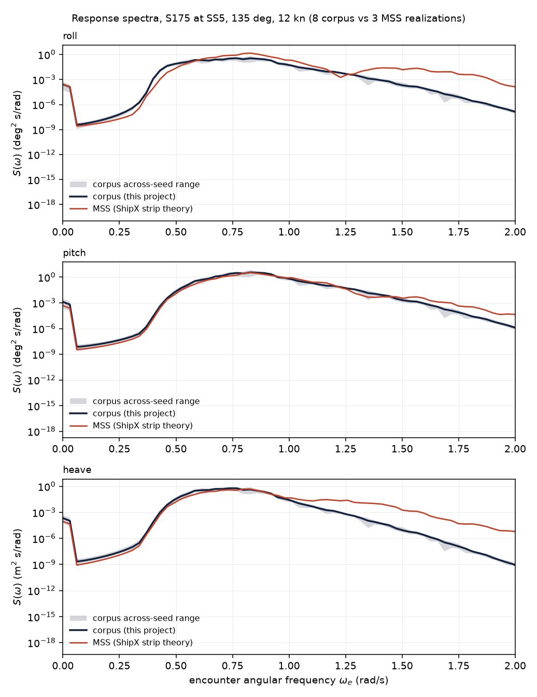
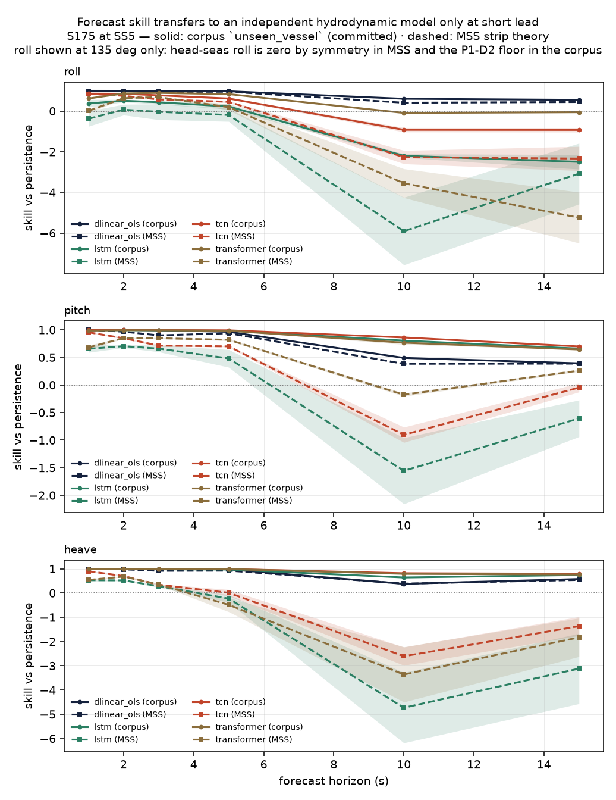

# MSS cross-validation — do the forecasters transfer to an independent hydrodynamic model?

**These are simulated results.** Both sides of every comparison below are simulations: the corpus
is this project's reduced-order generator, and MSS is ShipX strip theory. Neither is a measurement
of a real ship, and nothing here is real-world validation.

Regenerate with:

```
make mss        # export -> compare -> evaluate -> figures -> gate8
```

Phase 8, timeboxed to 5 hours. Protocol entries P8-D1 through P8-D9 in `docs/protocol.md`.

---

## Why this was worth doing

Every accuracy result in this project comes from one simulator, and two protocol entries already
said that prejudges the headline. P4-D16: "the corpus makes a linear forecaster Bayes-optimal by
construction." And `configs/sim/vessels/s175.yaml:42-45`, on the held-out hull:

> a reduced-order stand-in for a different ship, not a strip-theory computation of the S-175's
> actual RAOs, so `unseen_vessel` measures transfer across a parameter shift rather than across a
> genuinely different hull form.

The MSS toolbox ships exactly what that sentence says we lack: ShipX strip-theory **motion RAOs**
for the ITTC S-175, on a 36-frequency by 36-heading grid. Because our corpus already holds the S175
out of training as the `unseen_vessel` regime, evaluating the same checkpoints on MSS S175
trajectories is a tightly controlled experiment — same models, same normalisation statistics, same
task, same nominal hull. **Only the generator changes.**

## What was done

| | |
|---|---|
| Upstream | `github.com/cybergalactic/MSS` pinned at `98970f7` (2026-09-07) |
| Hull | ITTC S-175, `HYDRO/vessels_shipx/s175/s175.mat`, ShipX strip theory |
| Sea state | SS5: Hs 3.3 m, Tp 9.7 s, gamma 3.3 — identical to `configs/sim/sea_states.yaml` |
| Cells | headings 180 and 135 deg x speeds 0, 6, 12 kn x 3 seeds = 18 realizations |
| Record | 600 s at 10 Hz, 299 jittered components — matched to the corpus exactly |
| Models | `unseen_vessel` checkpoints, default arm, lookback 200, no ablations |
| Baselines | `persistence`, `window_mean`, `dlinear_ols` **recomputed on the MSS records** |

Octave was installed and MSS's own `waveMotionRAO.m` was run against our NumPy port. They agree to
**4.42e-12** relative, with RMS ratios of 1.00000000 — so the port is not merely statistically
similar to MSS's implementation, it reproduces it. The parity check earned its place twice, catching
two bugs that no self-consistency test could have reached: MSS's gravity constant (9.8100004 against
our 9.80665, which drifted the record 1.3% pointwise while RMS still agreed to 0.1%) and a
nearest-node heading snap that was exact at 180 deg and 38% wrong at 135 deg — the only heading where
roll is live. Details in P8-D4.

## Result 1 — the generators agree on *when*, not on *how much*

Per-DOF statistics at SS5, each MSS value quoted against the corpus's **own across-seed spread**,
because "the spectra overlay closely" is unfalsifiable without that yardstick.

| heading | DOF | corpus | MSS | ratio | z (corpus sd) |
|---|---|---|---|---|---|
| 135 deg | heave | 0.480 m | 0.363 m | 0.77 | −4.0 |
| 135 deg | pitch | 1.113 deg | 0.871 deg | 0.79 | −3.7 |
| 135 deg | roll | 0.584 deg | 0.576 deg | 1.13 | +3.1 |
| 180 deg | heave | 0.459 m | 0.202 m | 0.46 | −9.0 |
| 180 deg | pitch | 1.501 deg | 0.642 deg | 0.44 | −7.5 |
| 180 deg | roll | 0.038 deg | 0.000 deg | 0.00 | −22.4 |

Zero-crossing periods agree far better: ratios 0.85 to 1.04 throughout.

So our reduced-order generator is 1.3x hot at bow-quartering and 2.2x hot in head seas, while
reproducing the motion's *timescales* well. The head-seas roll row is not a disagreement about roll:
MSS gives exactly zero by port/starboard symmetry, and the corpus value is entirely the P1-D2
residual floor. That cell was excluded from the headline in advance (P8-D1) because a skill score
against a zero-variance target is undefined.



## Result 2 — skill transfers at short lead and collapses at long lead



Pitch, mean over cells and three seeds. Solid is the committed corpus `unseen_vessel` row; dashed is
the same checkpoint on MSS trajectories.

| horizon | `dlinear_ols` | `tcn` | `lstm` | `transformer` |
|---|---|---|---|---|
| 1 s | 0.997 | 0.953 | 0.656 | 0.681 |
| 2 s | 0.965 | 0.847 | 0.703 | 0.850 |
| 3 s | 0.899 | 0.714 | 0.659 | 0.847 |
| 5 s | 0.936 | 0.700 | 0.481 | 0.819 |
| **10 s** | **0.383** | **−0.903** | **−1.556** | **−0.177** |
| 15 s | 0.386 | −0.047 | −0.606 | 0.260 |

At the pre-registered cell — pitch at 10 s — against the committed corpus values:

| model | corpus | MSS | change |
|---|---|---|---|
| `persistence` | 0.0000 | 0.0000 | by construction |
| `window_mean` | 0.0733 | −0.0586 | −0.132 |
| `dlinear_ols` | 0.4904 | 0.3835 | −0.107 |
| `dlinear` | 0.4144 | 0.3935 | −0.021 |
| `tcn` | 0.8604 | **−0.9033** | −1.764 |
| `lstm` | 0.8032 | **−1.5564** | −2.360 |
| `transformer` | 0.7654 | −0.1773 | −0.943 |

**The pre-registered primary prediction is falsified.** P8-D1 predicted the `unseen_vessel` ordering
would hold, with `tcn` retaining skill above 0.5. Instead the three deep models go *negative* — worse
than persistence — while the two linear models lose about 0.1 and 0.02 skill respectively.

**The pre-registered counter-hypothesis is confirmed.** The same entry recorded the opposite
prediction, implied by the generator defect found while building the bridge (P8-D6): if the deep
models were exploiting a roll/pitch/heave phase relationship our generator gets wrong by 90 degrees,
they should lose more than a per-channel linear map, which is the model least able to depend on
cross-channel phase. That is what happened.

## Controls

| control | result | reading |
|---|---|---|
| Sign-flip ablation | skill moves by ≤ 0.006 | the conclusion does not rest on the P8-D3 sign derivation |
| `persistence` self-skill | exactly 0.0 on both sides | the denominator was recomputed on MSS data, not carried over (delta 4) |
| Normalisation provenance | `unseen_vessel/train` | statistics come from the corpus training split (delta 3) |
| Pipeline parity | agrees to 1e-10 with `evaluate_models` | the external path is the corpus path |
| Amplitude rescaling | recovers ~18% of the drop | most of the collapse is structural, not a normalisation-range effect |

### The amplitude control, in detail

Our generator runs ~1.6x hot (Result 1), so after normalisation by `unseen_vessel/train`
statistics the MSS records present to the model at roughly half the amplitude of anything in
training. That alone could depress a deep model without any structural story being true. To separate
the two, each MSS channel was rescaled so its RMS matches the corpus mean for that cell — changing
the amplitude the model sees and leaving every phase, period and cross-channel relationship intact.

| model | MSS as-is | MSS rescaled | recovered |
|---|---|---|---|
| `dlinear_ols` | 0.3835 | 0.3835 | +0.0000 |
| `dlinear` | 0.3935 | 0.3935 | +0.0000 |
| `tcn` | −0.9033 | −0.5796 | +0.3237 |
| `lstm` | −1.5564 | −1.1062 | +0.4502 |
| `transformer` | −0.1773 | −0.1732 | +0.0041 |

The linear rows move by **exactly zero**, which is the control working: skill is scale-invariant and
a per-channel constant cannot reach it. The deep rows recover some skill and **stay strongly
negative**. For `tcn`, rescaling returns 0.32 of a 1.76 drop — about 18%. So the normalisation-range
effect is real and is a minority of the story; roughly four fifths of the collapse survives it.

## What this does and does not establish

**It establishes** that in the 1–5 s band — the band the project exists to serve — every model keeps
positive skill on an independent hydrodynamic computation, so short-horizon deck-motion forecasting
is learning something real about wave response and not purely an artifact of our generator.

**It also establishes** that the deep models' headline advantage does not survive that transfer, and
that the advantage was measured precisely where it fails to transfer. Gates 3, 4 and 5 were all read
at pitch / 10 s, a cell chosen in P3-D12 and kept in P4-D1 and P5-D2. At 10 s the deep models beat
`dlinear_ols` by 0.37 on the corpus and lose to it by 1.29 on MSS. P4-D14 restriction 2 had already
found that `tcn` merely *ties* `dlinear_ols` in the 1–5 s operational band; this phase adds that
where it does not tie, it does not transfer.

**It does not establish** that the deep architectures are bad at deck-motion forecasting. It
establishes that *these* checkpoints, trained on *this* corpus, learned long-horizon structure that
is specific to this generator. A corpus without the P8-D6 phase defect might well support a deep
model that transfers; that is a Phase 9 question, not one this run can answer.

**It does not establish anything about real ships.** MSS is another simulator. Strip theory is
linear potential flow: no viscous roll damping beyond an empirical term, no parametric resonance, no
green water. The agreement or disagreement of two simulators bounds generator-specific overfitting;
it says nothing about either one's fidelity to a real deck.

## The limitation this leaves

`src/dmf/sim/response.py:229` applies a **real** wave-slope excitation to roll and pitch, so both
come out in phase with heave where strip theory puts them in quadrature (P8-D6, measured 0.1 deg
against 87.8 deg at w = 0.300 rad/s). Amplitudes are right; only the cross-DOF phase is wrong.
Per-DOF marginals are untouched, so every Gate 1 invariant still holds and
`results/physics_validation.md` is unaffected.

It was not fixed. Fixing it invalidates the corpus and every result in Phases 2 through 7, which is
far outside a 5-hour timebox. It is the largest open item this phase produced and is carried to
Phase 9.
