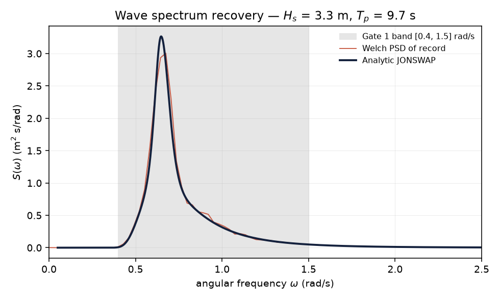
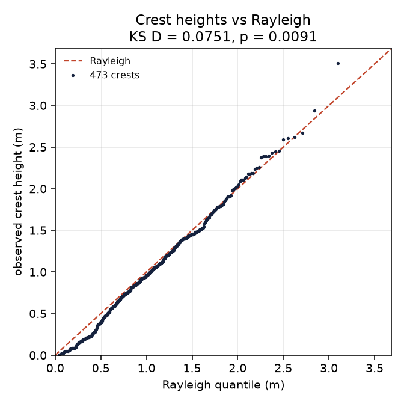
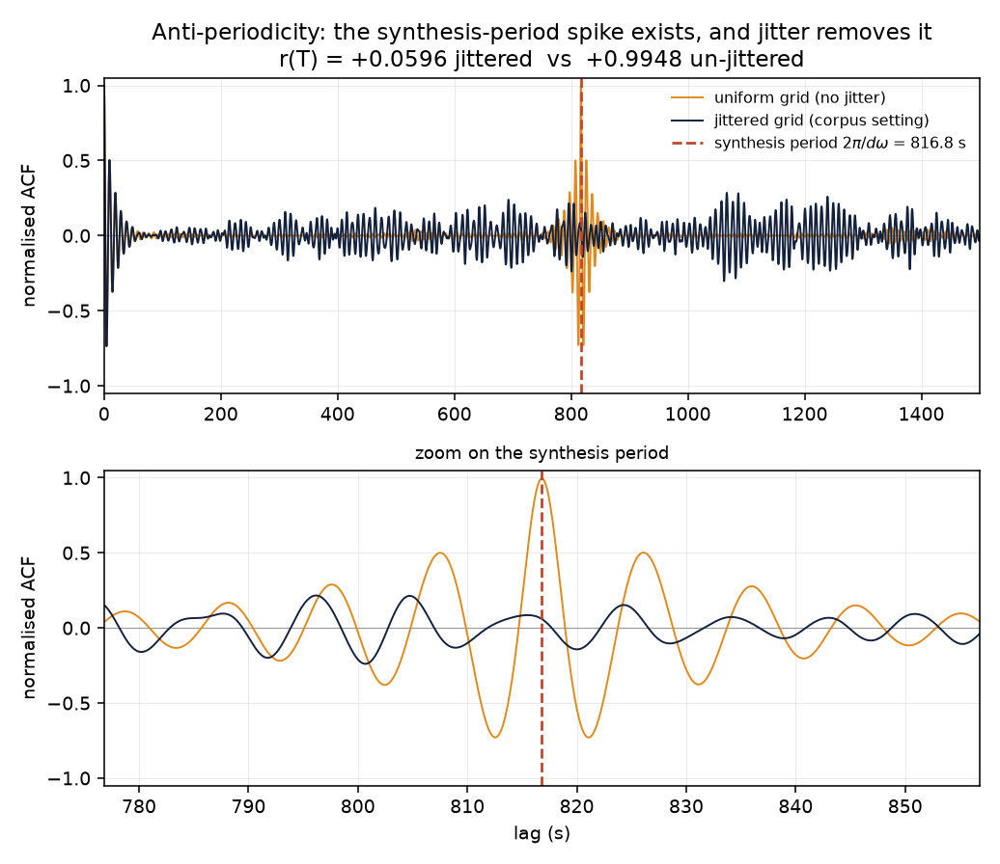
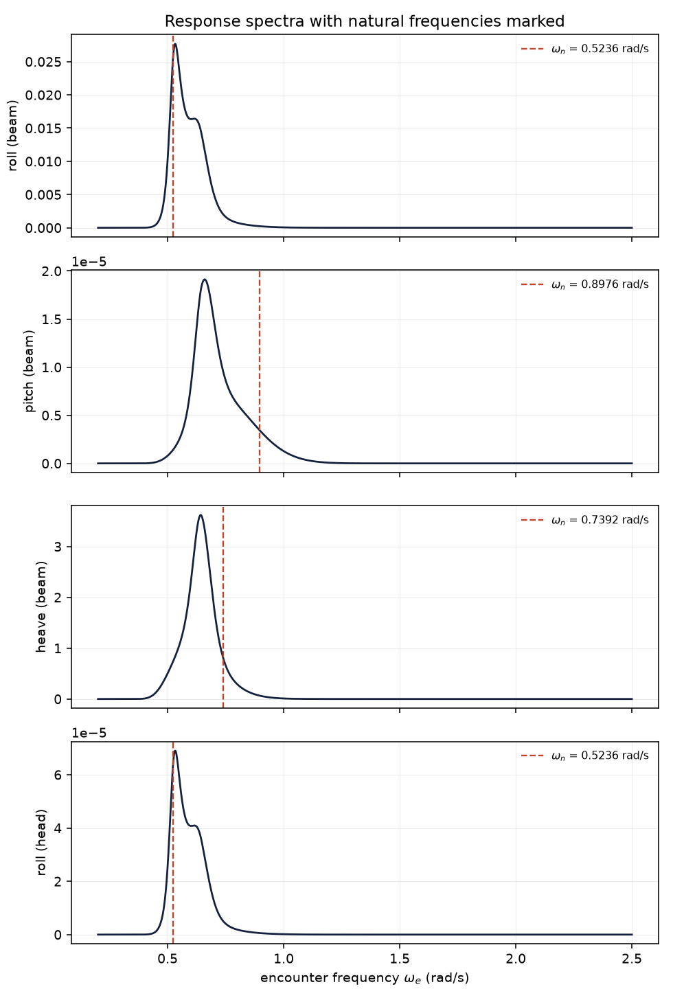
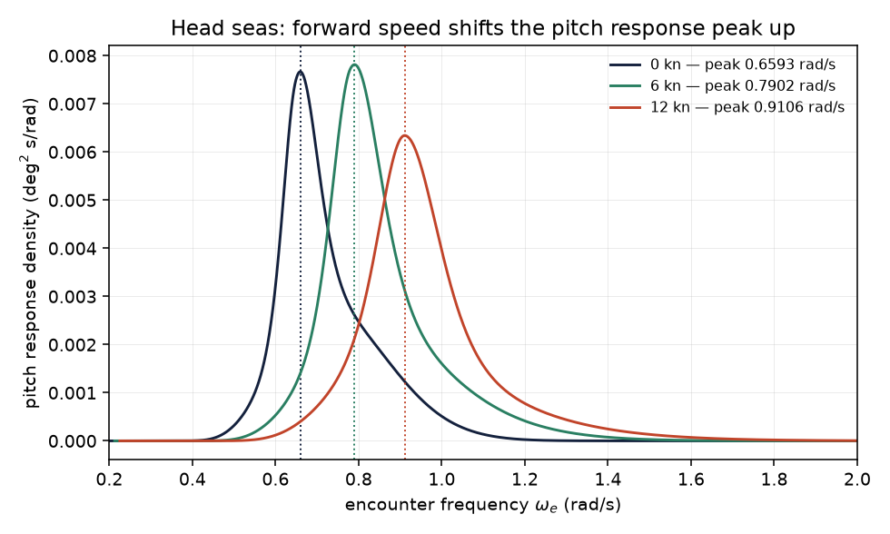

# Gate 1 — physics validation

**All motion in this project is simulated.** Nothing here is derived from, or validated against,
real ship-deck measurements. Every figure and number below comes from `dmf.sim` and is regenerated
by `pytest tests/test_spectra.py tests/test_response.py -s` and
`python scripts/physics_validation.py`.

The eight Gate 1 invariants of `docs/IMPLEMENTATION_PLAN.md` §Phase 1 are asserted in
`tests/test_spectra.py` (1-5) and `tests/test_response.py` (6-8). **No threshold was changed.**
Design decisions taken during the phase are recorded in `docs/protocol.md`.

## Summary

| # | Invariant | Threshold | Measured | |
|---|---|---|---|---|
| 1 | `4*sqrt(m0)` recovers `Hs` | within 2% | **+0.121%** | PASS |
| 2 | `Tz/Tp` band at `gamma=3.3` | 0.71-0.78 | **0.7775-0.7777** | PASS |
| 3 | Welch PSD vs analytic, [0.4, 1.5] rad/s | within 15% | **8.78%** (SS5), **4.23%** (SS6) | PASS |
| 4 | Crest heights Rayleigh (KS) | `p > 0.01` | **p = 0.276 / 0.157 / 0.054** | PASS |
| 5 | No ACF spike at `2*pi/dw` | see below | **r(T) = -0.051 / +0.005 / -0.014** | PASS |
| 6a | Beam-seas roll peaks at `wn_roll` | within 5% | **+2.36%** (SS5), **-0.47%** (SS6) | PASS |
| 6b | Head-seas roll RMS collapse | >= 10x | **20.02x (26.0 dB)** | PASS |
| 7 | SS5 beam-seas roll RMS | single-digit deg | **3.554 deg** | PASS |
| 8 | Forward speed shifts peak up | strictly increasing | **0.6681 -> 0.7995 -> 0.9231 rad/s** | PASS |

57 physics tests pass; 75 including corpus generation. `ruff check`, `ruff format --check` and
`mypy --strict` are clean.

## 1-2. Spectral moment recovery

Analytic JONSWAP integrated over `w` in [0.05, 30] rad/s, 400k points.

| Sea state | `Hs` error, `gamma=3.3` | `Tz` (s) | `Tz/Tp` | `Tp/Tz` |
|---|---|---|---|---|
| SS3 (1.0 m, 7.5 s) | +0.121% | 5.833 | 0.7777 | 1.2858 |
| SS4 (1.9 m, 8.8 s) | +0.121% | 6.843 | 0.7776 | 1.2860 |
| SS5 (3.3 m, 9.7 s) | +0.121% | 7.543 | 0.7776 | 1.2860 |
| SS6 (5.0 m, 12.4 s) | +0.121% | 9.641 | 0.7775 | 1.2862 |

`Hs` error is -0.109% at `gamma=2.0` and -0.000% at `gamma=1.0`; the residual at `gamma=3.3` is a
property of the `(1 - 0.287 ln gamma)` normalisation, not of `Hs`, which is why it is identical
across sea states.

`Tp/Tz = 1.286` against the published value of 1.286 at `gamma=3.3`. **The margin against the 0.78
ceiling is only ~0.3%**, and it is set by the integration limit rather than the physics: `m2`
converges slowly (`w^2 S ~ w^-3`), so truncating at 2.5 rad/s would return 0.803 and fail. See
`docs/protocol.md` P1-D4.

## 3. Synthesised record reproduces the analytic spectrum



Welch PSD of a 3600 s record at 10 Hz, `nperseg = 2048`, averaged over 8 independent seeds and
band-averaged into 0.1 rad/s bands, versus the analytic JONSWAP. Max absolute deviation over the
eleven bands in [0.4, 1.5] rad/s: **8.78%** at SS5, **4.23%** at SS6, against a 15% tolerance.

The averaging is not cosmetic. A single record at this resolution carries ~17% per-bin standard
deviation, so a per-bin 15% assertion on one seed would flake about half the time; the multi-seed
average brings the estimator to ~4% and makes the tolerance a genuine ~3.7 sigma test.

## 4. Crest heights are Rayleigh-distributed



Crest heights are taken between successive upward zero crossings — **not** all local maxima, which
follow a Rice distribution for a broadband process and would make the test wrong by construction.
The Rayleigh scale is fixed at `sqrt(m0)` from the record variance rather than fitted, so the
p-value stays honest.

| Seed | crests | `sqrt(m0)` (m) | KS `D` | `p` |
|---|---|---|---|---|
| 0 | 460 | 0.8297 | 0.0460 | 0.2759 |
| 1 | 463 | 0.8260 | 0.0521 | 0.1565 |
| 2 | 470 | 0.8123 | 0.0616 | 0.0544 |

This is the thinnest-margin invariant: over 20 further seeds the minimum `p` was 0.0114 against the
0.01 threshold. The residual is real finite-bandwidth non-Rayleigh-ness, not a bug.

## 5. Anti-periodicity — the invariant this project most depends on



A uniform frequency grid makes the wave record repeat with period `2*pi/dw`. If that period is
shorter than the record, the forecaster memorises the loop and **every downstream result becomes
meaningless without anything looking wrong**. The corpus therefore jitters each component frequency
within its bin.

With 299 components over [0.2, 2.5] rad/s, `dw = 0.007692 rad/s` and `T_period = 816.81 s`, which
repeats **4.41 times inside the 3600 s record**. The test asserts that the period falls inside the
record *before* testing for a spike, so it cannot pass because the period fell out of range.

| Quantity | Jittered (corpus setting) | Un-jittered control | Assertion |
|---|---|---|---|
| `r(T_period)` | -0.051 / +0.005 / -0.014 | **+0.9923** | `< 0.20` / `> 0.95` |
| peak near `T` / background p99.9 | 0.419 / 0.833 / 0.633 | **5.43** | `< 1.5` / `> 1.5` |
| comb power fraction | 0.2885 | **0.9999** | `< 0.5` / `> 0.99` |
| `max‖eta(t) - eta(t+T)‖ / sigma` | 1.443 | **1.167e-12** | `> 0.5` / `< 1e-9` |

**The test asserts both directions.** The un-jittered control column is what makes the jittered
column evidence rather than an assumption: the spike is demonstrably detectable, and jitter
demonstrably removes it. Over 20 further seeds the jittered `|r(T)|` never exceeded 0.175 and the
peak-to-background ratio never exceeded 1.051.

## 6-7. Vessel response



Frigate (`configs/sim/vessels/frigate.yaml`), SS5, zero speed. Vertical lines mark each DOF's
undamped natural frequency.

| Quantity | Measured | Threshold |
|---|---|---|
| Beam-seas roll spectral peak, SS5 | 0.5360 rad/s (**+2.36%** vs `wn_roll` = 0.5236) | within 5% |
| Beam-seas roll spectral peak, SS6 | 0.5212 rad/s (**-0.47%**) | within 5% |
| Roll RMS, beam seas SS5 | **3.686 deg** | — |
| Roll RMS, head seas SS5 | **0.1841 deg** | — |
| Ratio | **20.02x (26.0 dB)** | >= 10x |
| **SS5 beam-seas roll RMS (invariant 7)** | **3.554 deg** (per-seed 3.636 / 3.488 / 3.538) | single-digit deg |

**Sanity check against published seakeeping figures.** 3.55 deg RMS implies a significant single
amplitude of ~7.1 deg, i.e. roughly 14 deg peak-to-peak in SS5 beam seas for an unstabilised
124 m frigate. That is the right order for a hull of this size without active fin stabilisation,
sitting at the upper end of the 2-4 deg RMS band usually quoted. It is **not** the product of an
amplitude fit: `gain = 1.0` on both hulls and no calibration constant was tuned.

Two features of the roll panel are worth reading directly off the figure:

- The **shoulder at ~0.63 rad/s** next to the resonance peak is the wave-driven response at
  `wp = 0.648 rad/s`. At `zeta = 0.08` that shoulder rises to within 9% of the resonance peak and
  the spectral argmax flips between them from seed group to seed group. This is why the frigate's
  roll damping is 0.06 — recorded in full, with the peak-separation table, in `docs/protocol.md`
  P1-D3. It is a physics-parameter choice made in the knowledge that it affects criterion 6a.
- Criterion 6a is asserted at **SS5 and SS6 only**. The roll spectrum peaks at `wn_roll` only when
  the wave spectrum carries energy there; at SS3 the analytic peak error is **+55.9%** because the
  response is dragged to the wave peak at 0.816 rad/s. That is correct physics and is reported
  rather than suppressed.

## 8. Forward speed shifts the encounter-frequency peak



Head seas, frigate, SS5. Pitch is used rather than roll: lightly damped roll stays resonance-locked
at `wn` regardless of speed and cannot detect an encounter shift.

| Speed | Pitch response peak |
|---|---|
| 0 kn | 0.6681 rad/s |
| 6 kn | 0.7995 rad/s |
| 12 kn | 0.9231 rad/s |

## Supporting checks

Not Gate 1 criteria, but asserted in the same suite:

| Check | Measured |
|---|---|
| Roll RMS scales linearly with `Hs` | ratio **2.000000** for a 2x `Hs` change (exact, as a linear system requires) |
| Roll RMS vs `Tp` (resonance) | 1.345 / 3.620 / **6.208** / 4.079 deg at `Tp` = 7.5 / 9.7 / **12.0** / 15.0 s — peaks at `Tp = Tn_roll` |
| Roll RMS vs damping | 3.824 / 3.169 / 2.675 deg at `zeta` = 0.05 / 0.08 / 0.12 |
| Roll RMS vs heading | 0.173 / 2.451 / 3.462 / 2.451 deg at 180 / 135 / 90 / 45 deg |
| RAO limits | `|H(0)| = 1.0000`, `|H(wn)| = 1/(2 zeta)` to 4 dp, `|H(1000 wn)| = 1e-6` |
| Analytic vs central-difference rates | roll rate 0.07%, heave acceleration 0.08% relative error |
| Phase coherence | max `|xcorr|` roll-pitch **0.693** with a shared phase set vs **0.157** with independent phases; roll-heave 0.844 |
| Discrete synthesis variance | `sum(A^2)/2` matches band-limited `m0` to within 0.33% across SS3-SS6 |
| Non-monotonic encounter cells | (45 deg, 6 kn) at `w_crit` = 2.247 rad/s; (45 deg, 12 kn) at 1.124 rad/s |
| No `torch` under `src/dmf/sim/` | 7 modules AST-scanned, clean |

The phase-coherence result is the one that matters for the modelling phases: roll, pitch and heave
are synthesised from a **shared phase set**, so they carry genuine cross-DOF structure (0.693)
rather than the 0.157 that independent phases would give. That structure is what a multivariate
forecaster is supposed to exploit, and it exists in the corpus by construction.

## Reproducing

```
pytest tests/test_spectra.py tests/test_response.py -s   # all measured values printed
python scripts/physics_validation.py                     # regenerate the five figures
```
